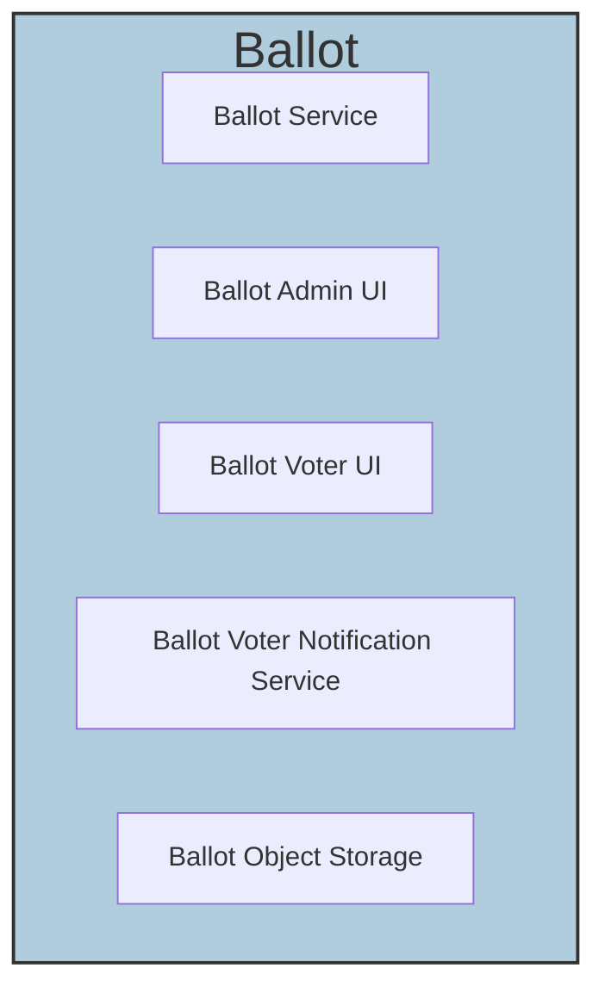

```mermaid
graph TB
    classDef external stroke:#f00, fill:#f92, color:#fffffff,font-size:20px
    classDef internal stroke:#f00, fill:lightgrey,  color:#2afff,font-size:20px
    classDef notify stroke:#00f, fill:#4D9900, color:#ffffff,font-size:20px
    classDef storage fill:#f96, color:#FFFccc,font-size:20px
    classDef ui fill:#f9ffff, stroke:#333, stroke-width:2px,font-size:20px
    classDef domain fill:#afcddd, stroke:#333, stroke-width:2px,font-size:30px


 

 subgraph Ballot["Ballot"]
        BS["Ballot Service"]
        BAdminUI["Ballot Admin UI"]
        BVoterUI["Ballot Voter UI"]
        BVN["Ballot Voter Notification Service"]
        BOBJ["Ballot Object Storage"]
  end
Ballot:::domain
```