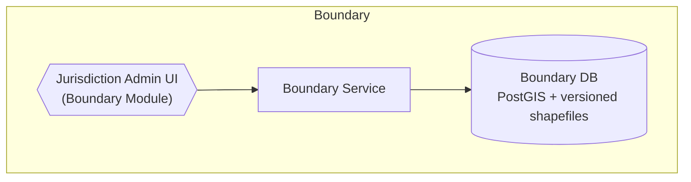
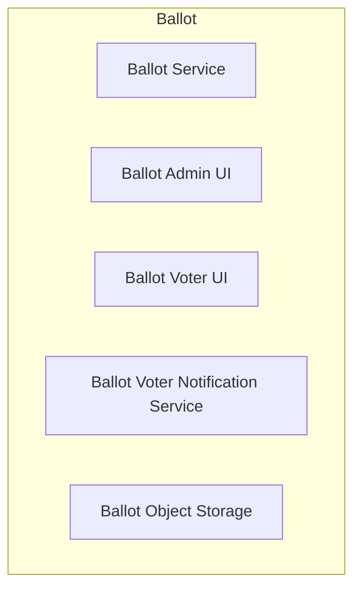
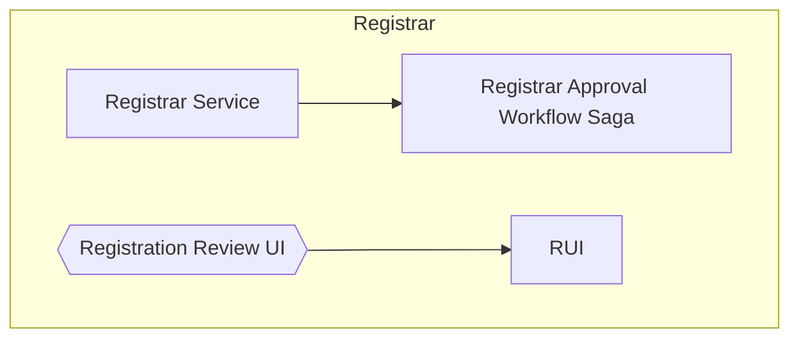
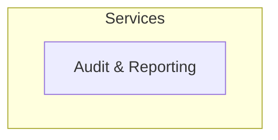
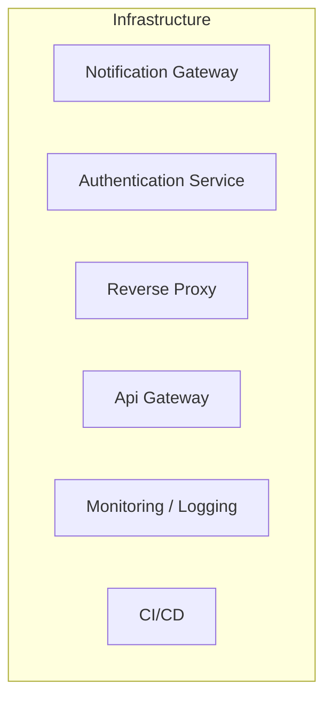
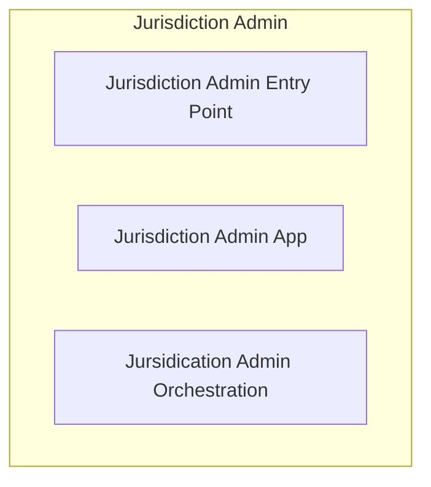
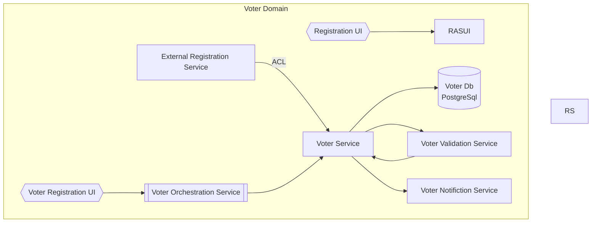
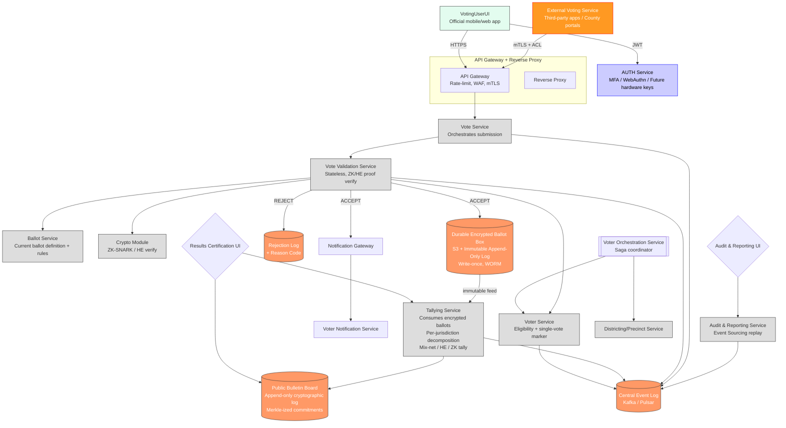

```mermaid
graph LR
    classDef external stroke:#f00, fill:#f92, color:#fffffff,font-size:20px
    classDef internal stroke:#f00, fill:lightgrey,  color:#2afff,font-size:20px
    classDef notify stroke:#00f, fill:#4D9900, color:#ffffff,font-size:20px
    classDef storage fill:#f96, color:#FFFccc,font-size:20px
    classDef ui fill:#f9ffff, stroke:#333, stroke-width:2px,font-size:20px
    classDef domain fill:#afcddd, stroke:#333, stroke-width:2px,font-size:30px


 
 subgraph ED [Election]
        


end
```

```mermaid
graph TB
  subgraph Boundary ["Boundary"]
      BS["Boundary Service"]:::internal
      BAdminUI{{"Jurisdiction Admin UI<br>(Boundary Module)"}}:::ui
      BStore[(Boundary DB<br>PostGIS + versioned shapefiles)]:::storage
      
      BS --> BStore
      BAdminUI --> BS
  end

  Boundary:::domain
  

```

```mermaid
graph TB
 subgraph Ballot["Ballot"]
        BS["Ballot Service"]
        BAdminUI["Ballot Admin UI"]
        BVoterUI["Ballot Voter UI"]
        BVN["Ballot Voter Notification Service"]
        BOBJ["Ballot Object Storage"]
  end
Ballot:::domain
```

```mermaid
graph TB
 subgraph Registar[Registrar]
        RAS["Registrar Service"]-->
        RASAGA[Registrar Approval Workflow Saga]
        RASUI{{"Registration Review UI"}}-->RUI
  end
Registar:::domain
```

```mermaid
graph TB
 subgraph Services["Services"]
        AS["Audit & Reporting"]
  end
```

```mermaid
graph TB
 subgraph Infrastructure["Infrastructure"]
        NG["Notification Gateway"]
        AUTH["Authentication Service"]
        RP["Reverse Proxy"]
        APIG["Api Gateway"]
        OBS["Monitoring / Logging"]
        CI["CI/CD"]
  end
```

```mermaid
graph TB

 subgraph subGraph7["Jurisdiction Admin"]
        JAWEB["Jurisdiction Admin Entry Point"]
        JAMOB["Jurisdiction Admin App"]
        JAORCH["Jursidication Admin Orchestration"]
  end
```

```mermaid
graph TB
 subgraph VoterDomain[Voter Domain]
        PRS["External Registration Service"]--ACL-->VRS
        VRUI{{"Voter Registration UI"}}-->
        VORCH[[Voter Orchestration Service]]-->VRS
        RUI{{"Registration UI"}}-->RASUI
        VRS[Voter Service]-->Voters
        VRS-->ValS
        VRS-->VRN
        ValS["Voter Validation Service"]-->VRS
        VRN["Voter Notifiction Service"]
        Voters[("Voter Db<br>PostgreSql")]
  end


 VoterDomain:::domain
 VRN:::notify
 PRS:::external
 RS:::internal
 ValS:::internal
 Voters:::storage
    
```

```mermaid
graph TB
    %% External world
    EVS[External Voting Service<br/>Third-party apps / County portals]:::external
    VoterPhone[VotingUserUI<br/>Official mobile/web app]:::ui

    %% Entry points
    subgraph API_GW["API Gateway + Reverse Proxy"]
        APIG[API Gateway<br/>Rate-limit, WAF, mTLS]
        RP[Reverse Proxy]
    end

    %% Authentication (still TBD – shown as central for now)
    AUTH[AUTH Service<br/>MFA / WebAuthn / Future hardware keys]:::infra

    %% Core voting flow
    VoterPhone -->|JWT| AUTH
    EVS -->|mTLS + ACL| APIG
    VoterPhone -->|HTTPS| APIG

    APIG --> VS[Vote Service<br/>Orchestrates submission]:::internal
    VS --> VVS[Vote Validation Service<br/>Stateless, ZK/HE proof verify]:::internal

    %% Services VVS depends on
    VVS --> VoterService[Voter Service<br/>Eligibility + single-vote marker]:::internal
    VVS --> BallotService[Ballot Service<br/>Current ballot definition + rules]:::internal
    VVS --> Crypto[Crypto Module<br/>ZK-SNARK / HE verify]:::internal

    %% Durable storage after validation
    VVS -->|ACCEPT| BOBJ[(Durable Encrypted Ballot Box<br/>S3 + Immutable Append-Only Log<br/>Write-once, WORM)]:::storage
    VVS -->|REJECT| RejectLog[(Rejection Log<br/>+ Reason Code)]:::storage
    VVS -->|ACCEPT| NG[Notification Gateway] --> VRN[Voter Notification Service]

    %% Tallying pulls from the durable box
    BOBJ -->|immutable feed| TS[Tallying Service<br/>Consumes encrypted ballots<br/>Per-jurisdiction decomposition<br/>Mix-net / HE / ZK tally]:::internal
    TS --> PublicBB[(Public Bulletin Board<br/>Append-only cryptographic log<br/>Merkle-ized commitments)]:::storage

    %% Certification & Audit
    RCS{Results Certification UI} --> TS
    RCS --> PublicBB
    ARUI{Audit & Reporting UI} --> ARS[Audit & Reporting Service<br/>Event Sourcing replay]:::internal
    ARS --> EventStore[(Central Event Log<br/>Kafka / Pulsar)]:::storage

    %% Event sourcing backbone
    VS --> EventStore
    VVS --> EventStore
    TS --> EventStore
    VoterService --> EventStore

    %% Districting integration (post-MVP)
    VORCH[[Voter Orchestration Service<br/>Saga coordinator]] --> JDPS[Districting/Precinct Service]:::internal
    VORCH --> VoterService

    %% Styling
    classDef external fill:#f92,stroke:#f00,color:#fff
    classDef ui fill:#e3fcef,stroke:#333
    classDef internal fill:#ddd,stroke:#333
    classDef storage fill:#f96,stroke:#333,color:#fff
    classDef infra fill:#ccf,stroke:#00f,color:#000
    classDef domain fill:#afcddd,stroke:#333,stroke-width:3px
```