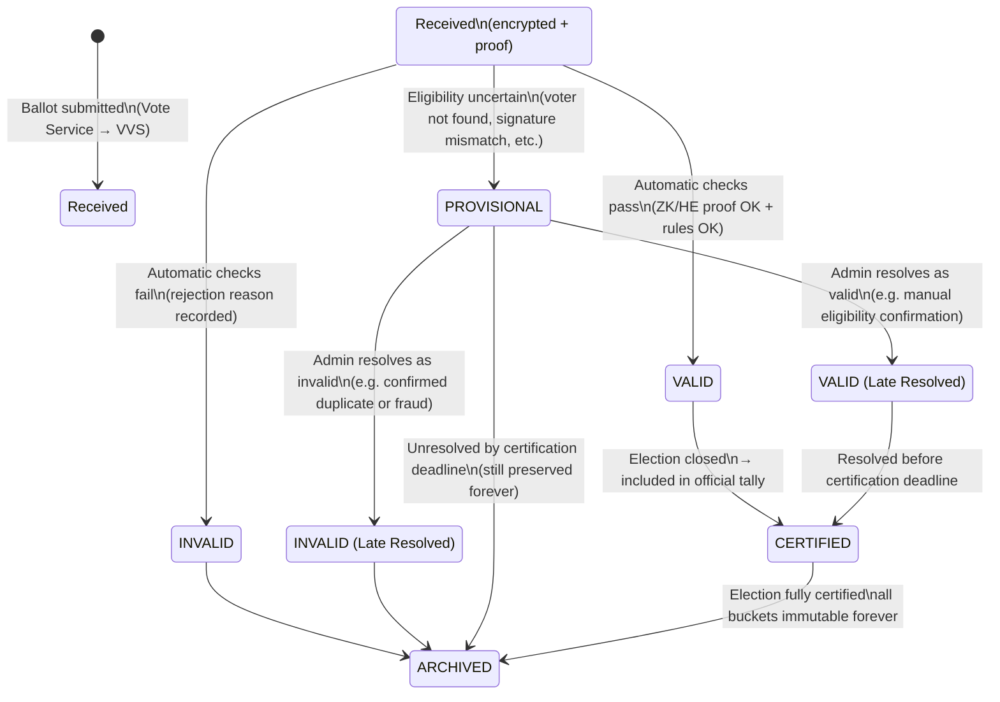
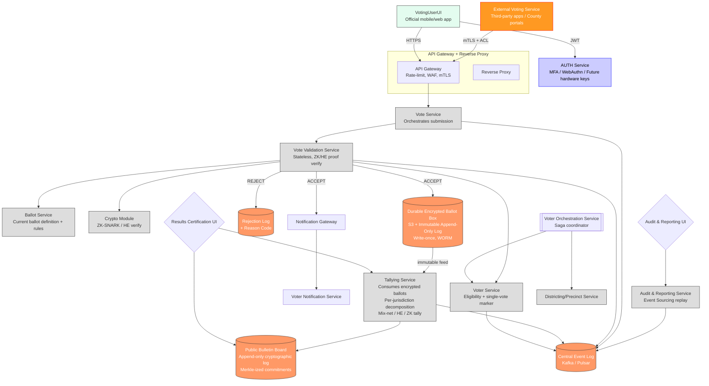
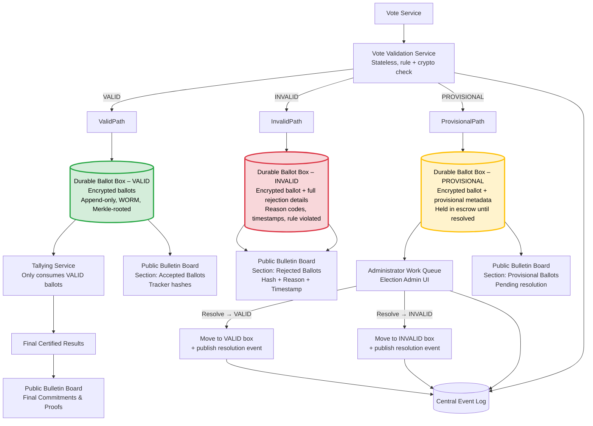

Project Goal
Build “Electioneer” – a safe, secure, verifiable internet voting system that supports complex ballot rules (Ranked-Choice Voting, multi-seat contests, propositions, etc.) while providing perfect auditability and voter privacy.
Core Architectural Decisions (Locked In)
1. Domain Separation (Bounded Contexts)

Election Domain
Voter Domain
Ballot Domain
Registrar Domain
Districting/Precinct Domain
Jurisdiction Admin Domain
Infrastructure (Auth, API Gateway, Notification Gateway, Monitoring, CI/CD)

2. Ballot Submission Flow (MVP → Production)
Voter UI / External Voting Service (EVS) → API Gateway → Vote Service → Vote Validation Service (VVS)
VVS performs:

Voter eligibility check (sync call to Voter Service)
Single-vote enforcement
Cryptographic verification (ZK proofs or homomorphic encryption)
Ballot definition lookup + rule engine execution once rules are finalized
Decision: VALID | INVALID | PROVISIONAL

3. Ballot Persistence & Auditability
All ballots (regardless of status) are permanently preserved:

StateStorage BucketCounts in Tally?Public Bulletin Board VisibilityRetentionVALIDBOBJ_VALIDYesTracker hashForeverINVALIDBOBJ_INVALIDNoFull rejection reason + timestampForeverPROVISIONALBOBJ_PROVISIONAL (escrow)No (until resolved)Marked “under review” + reasonForeverResolved → VALID/INVALIDMoved to respective bucketaccordinglyResolution trail publishedForever

Durable Ballot Box = immutable, append-only, WORM storage (e.g., S3 + Glacier Vault Lock or similar)
Tallying Service only ever consumes VALID ballots from BOBJ_VALID

4. Public Transparency

Public Bulletin Board (append-only, Merkle-ized cryptographic log)
Section: Accepted Ballots
Section: Rejected Ballots (with reason)
Section: Provisional Ballots (pending/under review)
Section: Resolutions & Final Commitments

5. Cryptographic Roadmap

Phase 1 (MVP): Additive homomorphic encryption (ElectionGuard-style) – fast tally, individual verifiability
Phase 2: zk-SNARKs (or equivalent) for complex rules (RCV, multi-seat, overvote detection, etc.)
Long-term: hybrid or full ZK for end-to-end verifiability without trusted tally ceremony

6. External Integration

Multiple External Voting Services (EVS) allowed
EVS connects via mTLS + ACL or future public batch ballot-submission API
Anonymization/mixing happens server-side after validation

7. Event Sourcing & Audit

Central event log (Kafka / Pulsar)
Every service publishes immutable events
Audit & Reporting Service can replay or reconstruct any election state at any time

8. Voter Registration (MVP Scope)

Voter Orchestration Service (VORCH) coordinates registration saga
MVP: basic validation only
Post-MVP: address changes that cross precincts/districts → coordination with Districting Service

9. Authentication (Still Open)

Central AUTH service shown (MFA, WebAuthn, future hardware-bound keys)
Final decision pending

10. Ballot State Machine (Canonical)
mermaidstateDiagram-v2
    [*] --> Received
    Received --> VALID
    Received --> INVALID
    Received --> PROVISIONAL
    PROVISIONAL --> VALID : Admin resolves valid
    PROVISIONAL --> INVALID : Admin resolves invalid
    VALID --> CERTIFIED
    VALID --> ARCHIVED : after certification
    INVALID --> ARCHIVED
    PROVISIONAL --> ARCHIVED : if unresolved by deadline
    CERTIFIED --> ARCHIVED
Current Diagrams (in project repo)

High-level domain diagram (domains.md – original + updates)
Vote Validation Service internal detail
Durable Ballot Box + three-state persistence flow
Full ballot state transition diagram (above)

This document is the living source of truth for Electioneer architecture. Update it as decisions evolve.Markdown please?Electioneer Architecture Summary
Living Document – Last Updated: November 21, 2025
Project Goal
Build Electioneer – an open-source, secure, verifiable internet voting system that supports complex ballot rules (Ranked-Choice Voting, multi-seat contests, propositions, etc.) while guaranteeing perfect privacy, auditability, and voter verifiability.
Core Architectural Decisions (Locked In)
1. Domain Separation (Bounded Contexts)

Election Domain
Voter Domain
Ballot Domain
Registrar Domain
Districting/Precinct Domain
Jurisdiction Admin Domain
Infrastructure (Auth, API Gateway, Notification Gateway, Monitoring, CI/CD)

2. Ballot Submission Flow
textVoter UI / External Voting Service (EVS)
    → API Gateway (mTLS + ACL)
    → Vote Service
    → Vote Validation Service (VVS)
Vote Validation Service (VVS) performs:

Voter eligibility (sync call to Voter Service)
Single-vote enforcement
Cryptographic verification (ZK proofs or homomorphic encryption)
Ballot definition + rule engine execution
Decision → VALID | INVALID | PROVISIONAL

3. Ballot Persistence & Auditability
All ballots are preserved forever in immutable, append-only storage.

StateStorage BucketCounts in Tally?Public Bulletin Board VisibilityRetentionVALIDBOBJ_VALIDYesTracker hashForeverINVALIDBOBJ_INVALIDNoFull rejection reason + timestampForeverPROVISIONALBOBJ_PROVISIONAL (escrow)No (until resolved)Marked “under review” + reasonForeverResolved → VALID/INVALIDMoved to respective bucketaccordinglyFull resolution trail publishedForever

Durable Ballot Box = WORM storage (e.g., S3 + Glacier Vault Lock, QuartzBlock, etc.)
Tallying Service only consumes VALID ballots

4. Public Transparency
Public Bulletin Board (append-only, Merkle-rooted):

Accepted Ballots (tracker hashes)
Rejected Ballots (with reason codes)
Provisional Ballots (pending resolution)
Resolution Log
Final Commitments & Proofs

5. Cryptographic Roadmap

| Phase|Technology|Scope
|---|---|---|
MVP|Additive homomorphic encryption (ElectionGuard-style)|"Simple contests| fast tally| individual verifiability"
Phase 2|zk-SNARKs (or equivalent)|"Full RCV| multi-seat| complex rules"
Long-term|Hybrid or pure ZK end-to-end|No trusted tally ceremony

6. External Integration

Multiple External Voting Services (EVS) supported (county portals, state apps, etc.)
Connect via mTLS + ACL or future public batch ballot-submission API
Anonymization/mixing performed server-side after validation

7. Event Sourcing & Audit

Central event log (Kafka or Pulsar)
Every service publishes immutable events
Audit & Reporting Service can replay any election state at any time

8. Voter Registration

Voter Orchestration Service (VORCH) coordinates registration saga
MVP scope: basic validation only
Post-MVP: address changes that cross precincts → coordination with Districting Service

9. Authentication (Decision Pending)

Currently modeled as central AUTH service (MFA, WebAuthn, future hardware-bound keys)
Open question: centralized vs per-UI WebAuthn

10. Official Ballot State Machine

Current Reference Diagrams (in repo)

High-level domain diagram (domains.md)

Vote Validation Service internal detail

Durable Ballot Box + three-state persistence flow

Full ballot state transition diagram (above)

