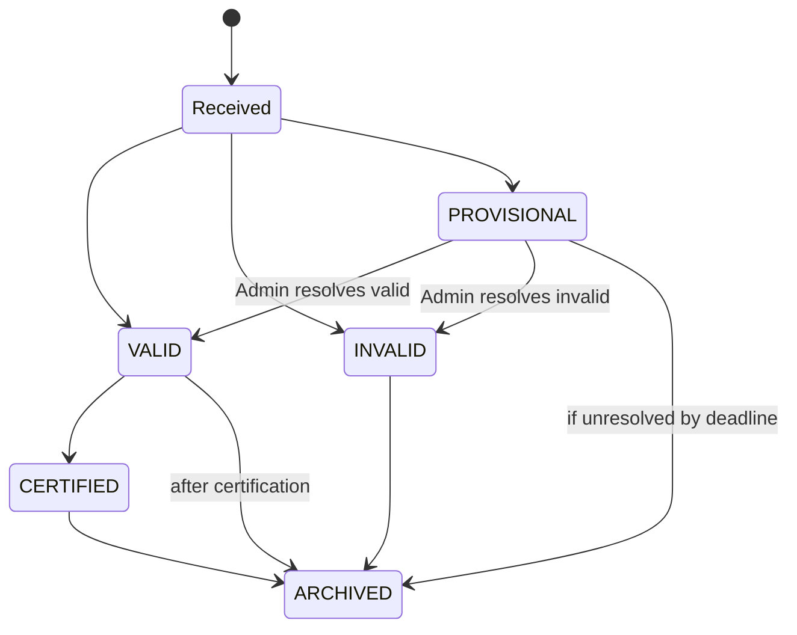

# Electioneer Architecture Summary  
*As of November 21, 2025 – Conversation with Grok*

## Project Goal
Build “Electioneer” – a safe, secure, verifiable internet voting system that supports complex ballot rules (Ranked-Choice Voting, multi-seat contests, propositions, etc.) while providing perfect auditability and voter privacy.

## Core Architectural Decisions (Locked In)

### 1. Domain Separation (Bounded Contexts)
- Election Domain  
- Voter Domain  
- Ballot Domain  
- Registrar Domain  
- Districting/Precinct Domain  
- Jurisdiction Admin Domain  
- Infrastructure (Auth, API Gateway, Notification Gateway, Monitoring, CI/CD)

### 2. Ballot Submission Flow (MVP → Production)
`Voter UI / External Voting Service (EVS) → API Gateway → Vote Service → Vote Validation Service (VVS)`

VVS performs:
- Voter eligibility check (sync call to Voter Service)
- Single-vote enforcement
- Cryptographic verification (ZK proofs or homomorphic encryption)
- Ballot definition lookup + rule engine execution once rules are finalized
- Decision: VALID | INVALID | PROVISIONAL

### 3. Ballot Persistence & Auditability
All ballots (regardless of status) are permanently preserved:

| State        | Storage Bucket                  | Counts in Tally? | Public Bulletin Board Visibility                     | Retention |
|--------------|---------------------------------|------------------|-------------------------------------------------------|-----------|
| VALID        | BOBJ_VALID                      | Yes              | Tracker hash                                          | Forever   |
| INVALID      | BOBJ_INVALID                    | No               | Full rejection reason + timestamp                     | Forever   |
| PROVISIONAL  | BOBJ_PROVISIONAL (escrow)       | No (until resolved) | Marked “under review” + reason                     | Forever   |
| Resolved → VALID/INVALID | Moved to respective bucket | accordingly     | Resolution trail published                            | Forever   |

- Durable Ballot Box = immutable, append-only, WORM storage (e.g., S3 + Glacier Vault Lock or similar)
- Tallying Service only ever consumes VALID ballots from BOBJ_VALID

### 4. Public Transparency
- Public Bulletin Board (append-only, Merkle-ized cryptographic log)
  - Section: Accepted Ballots
  - Section: Rejected Ballots (with reason)
  - Section: Provisional Ballots (pending/under review)
  - Section: Resolutions & Final Commitments

### 5. Cryptographic Roadmap
- Phase 1 (MVP): Additive homomorphic encryption (ElectionGuard-style) – fast tally, individual verifiability
- Phase 2: zk-SNARKs (or equivalent) for complex rules (RCV, multi-seat, overvote detection, etc.)
- Long-term: hybrid or full ZK for end-to-end verifiability without trusted tally ceremony

### 6. External Integration
- Multiple External Voting Services (EVS) allowed
- EVS connects via mTLS + ACL or future public batch ballot-submission API
- Anonymization/mixing happens server-side after validation

### 7. Event Sourcing & Audit
- Central event log (Kafka / Pulsar)
- Every service publishes immutable events
- Audit & Reporting Service can replay or reconstruct any election state at any time

### 8. Voter Registration (MVP Scope)
- Voter Orchestration Service (VORCH) coordinates registration saga
- MVP: basic validation only
- Post-MVP: address changes that cross precincts/districts → coordination with Districting Service

### 9. Authentication (Still Open)
- Central AUTH service shown (MFA, WebAuthn, future hardware-bound keys)
- Final decision pending

### 10. Ballot State Machine (Canonical)

### Current Diagrams (in project repo)
1. High-level domain diagram [(domains.md – original + updates)](domain.md)
2. [Vote Validation Service internal detail](votervalidation.md)
3. [Durable Ballot Box + three-state persistence flow](durableballotbox.md)
4. [Full ballot state transition diagram (above)](ballotstatetransitions.md)

This document is the living source of truth for Electioneer architecture. Update it as decisions evolve.