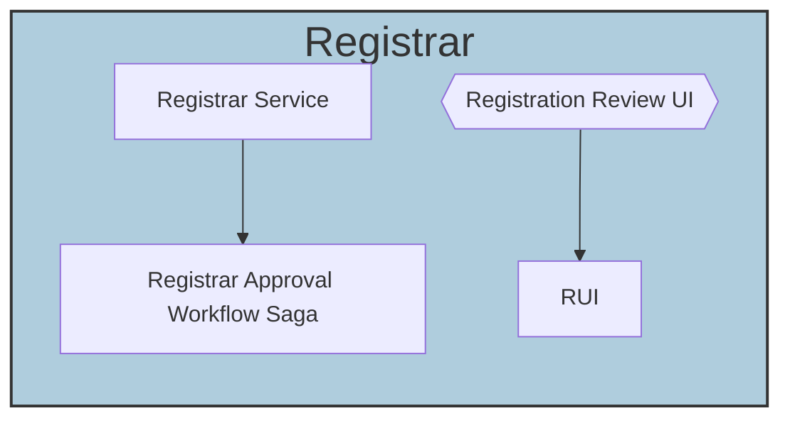

```mermaid
graph LR
    classDef external stroke:#f00, fill:#f92, color:#fffffff,font-size:20px
    classDef internal stroke:#f00, fill:lightgrey,  color:#2afff,font-size:20px
    classDef notify stroke:#00f, fill:#4D9900, color:#ffffff,font-size:20px
    classDef storage fill:#f96, color:#FFFccc,font-size:20px
    classDef ui fill:#f9ffff, stroke:#333, stroke-width:2px,font-size:20px
    classDef domain fill:#afcddd, stroke:#333, stroke-width:2px,font-size:30px


 
  subgraph Registrar[Registrar]
        RAS["Registrar Service"]-->
        RASAGA[Registrar Approval Workflow Saga]
        RASUI{{"Registration Review UI"}}-->RUI
  end
Registrar:::domain
```