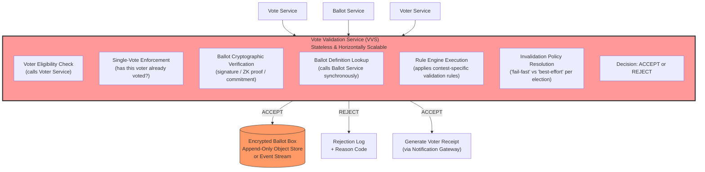

# Voter Validation 

```mermaid
graph TD
    VS[Vote Service] --> VVS
    subgraph VVS["Vote Validation Service (VVS)<br/>Stateless & Horizontally Scalable"]
        direction TB
        A["Voter Eligibility Check<br/>(calls Voter Service)"]
        B["Single-Vote Enforcement<br/>(has this voter already voted?)"]
        C["Ballot Cryptographic Verification<br/>(signature / ZK proof / commitment)"]
        D["Ballot Definition Lookup<br/>(calls Ballot Service synchronously)"]
        E["Rule Engine Execution<br/>(applies contest-specific validation rules)"]
        F["Invalidation Policy Resolution<br/>('fail-fast' vs 'best-effort' per election)"]
        G["Decision: ACCEPT or REJECT"]
    end

    VVS -->|ACCEPT| BallotBox[(Encrypted Ballot Box<br/>Append-Only Object Store<br/>or Event Stream)]
    VVS -->|REJECT| RejectLog["Rejection Log<br/>+ Reason Code"]
    VVS -->|ACCEPT| VoterReceipt["Generate Voter Receipt<br/>(via Notification Gateway)"]

    BallotService["Ballot Service"] --> VVS
    VoterService["Voter Service"] --> VVS

    style VVS fill:#ff9999,stroke:#333,stroke-width:3px
    style BallotBox fill:#f96,stroke:#333
```
