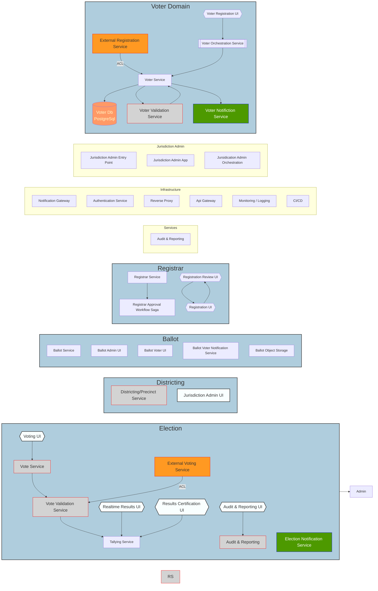

```mermaid
---
config:
  layout: dagre

  
---
graph LR
    classDef external stroke:#f00, fill:#f92, color:#fffffff,font-size:20px
    classDef internal stroke:#f00, fill:lightgrey,  color:#2afff,font-size:20px
    classDef notify stroke:#00f, fill:#4D9900, color:#ffffff,font-size:20px
    classDef storage fill:#f96, color:#FFFccc,font-size:20px
    classDef ui fill:#f9ffff, stroke:#333, stroke-width:2px,font-size:20px
    classDef domain fill:#afcddd, stroke:#333, stroke-width:2px,font-size:30px


 
 subgraph ED [Election]
        VotingUserUI{{"Voting UI"}}-->
        VotingService["Vote Service"]-->VVS[Vote Validation Service]-->
        TS["Tallying Service"]
        EVS[External Voting Service]--ACL-->VVS
        RRUI{{"Realtime Results UI"}}-->TS
        RCS{{"Results Certification UI"}}-->TS
        ARUI{{"Audit & Reporting UI"}} -->
        ARS["Audit & Reporting"]
        EN["Election Notification Service"]


VotingUserUI:::ui
VotingService:::internal
VVS:::internal
EVS:::external
RRUI:::ui
RCS:::ui
ARUI:::ui
ARS:::internal
EN:::notify
  end
ED:::domain
ED-->Admin
 subgraph DD [Districting]
        JDPS["Districting/Precinct Service"]
        JAdminUI["Jurisdiction Admin UI"]
  end
DD:::domain
JDPS:::internal
JAdminUI:::ui

 subgraph Ballot["Ballot"]
        BS["Ballot Service"]
        BAdminUI["Ballot Admin UI"]
        BVoterUI["Ballot Voter UI"]
        BVN["Ballot Voter Notification Service"]
        BOBJ["Ballot Object Storage"]
  end
Ballot:::domain


 subgraph Registar[Registrar]
        RAS["Registrar Service"]-->
        RASAGA[Registrar Approval Workflow Saga]
        RASUI{{"Registration Review UI"}}-->RUI
  end
Registar:::domain

 subgraph Services["Services"]
        AS["Audit & Reporting"]
  end
 subgraph Infrastructure["Infrastructure"]
        NG["Notification Gateway"]
        AUTH["Authentication Service"]
        RP["Reverse Proxy"]
        APIG["Api Gateway"]
        OBS["Monitoring / Logging"]
        CI["CI/CD"]
  end
 subgraph subGraph7["Jurisdiction Admin"]
        JAWEB["Jurisdiction Admin Entry Point"]
        JAMOB["Jurisdiction Admin App"]
        JAORCH["Jursidication Admin Orchestration"]
  end

 subgraph VoterDomain[Voter Domain]
        PRS["External Registration Service"]--ACL-->VRS
        VRUI{{"Voter Registration UI"}}-->
        VORCH[[Voter Orchestration Service]]-->VRS
        RUI{{"Registration UI"}}-->RASUI
        VRS[Voter Service]-->Voters
        VRS-->ValS
        VRS-->VRN
        ValS["Voter Validation Service"]-->VRS
        VRN["Voter Notifiction Service"]
        Voters[("Voter Db<br>PostgreSql")]
  end


 VoterDomain:::domain
 VRN:::notify
 PRS:::external
 RS:::internal
 ValS:::internal
 Voters:::storage
    
```