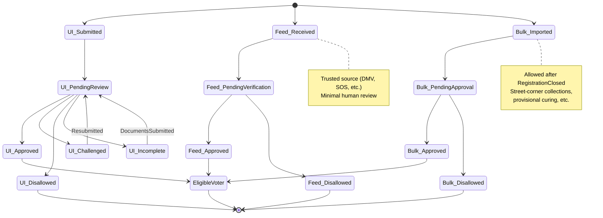

# Voter Registration Lifecycles

```mermaid
stateDiagram-v2
    %% ======================
    %% Path 1: UI Registration
    %% ======================
    [*] --> UI_Submitted
    UI_Submitted --> UI_PendingReview
    UI_PendingReview --> UI_Approved
    UI_Approved --> EligibleVoter

    UI_PendingReview --> UI_Challenged
    UI_PendingReview --> UI_Disallowed
    UI_PendingReview --> UI_Incomplete

    UI_Challenged --> UI_PendingReview : Resubmitted
    UI_Incomplete --> UI_PendingReview : DocumentsSubmitted

    UI_Disallowed --> [*]

    %% ======================
    %% Path 2: DMV / Official Feed
    %% ======================
    [*] --> Feed_Received
    Feed_Received --> Feed_PendingVerification
    Feed_PendingVerification --> Feed_Approved
    Feed_Approved --> EligibleVoter

    Feed_PendingVerification --> Feed_Disallowed
    Feed_Disallowed --> [*]

    %% ======================
    %% Path 3: Bulk Upload (post-cutoff)
    %% ======================
    [*] --> Bulk_Imported
    Bulk_Imported --> Bulk_PendingApproval
    Bulk_PendingApproval --> Bulk_Approved
    Bulk_Approved --> EligibleVoter

    Bulk_PendingApproval --> Bulk_Disallowed
    Bulk_Disallowed --> [*]

    %% ======================
    %% Shared final state
    %% ======================
    EligibleVoter --> [*]

    note right of Bulk_Imported
        Allowed after RegistrationClosed
        Street-corner collections,
        provisional curing, etc.
    end note

    note right of Feed_Received
        Trusted source (DMV, SOS, etc.)
        Minimal human review
    end note
```