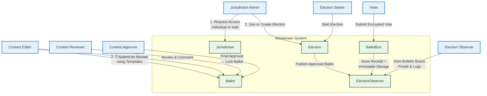

```mermaid

%% Electioneer Core Use Cases
graph TD
    %% Actors
    A[Jurisdiction Admin] 
    CE[Contest Editor] 
    CR[Contest Reviewer] 
    CA[Contest Approver] 
    ES[Election Starter] 
    V[Voter] 
    EO[Election Observer] 

    %% System boundaries
    subgraph "Electioneer System"
        J[Jurisdiction]
        E[Election]
        B[Ballot]
        EOBS[ElectionObserver]
        BB[BallotBox]
    end

    %% Flows
    A -->|1. Request Access<br/>individual or bulk| J
    A -->|2. Join or Create Election| E
    CE -->|3. Create/Edit Contests<br/>using Templates| B
    CE -->|Submit for Review| B
    CR -->|Review & Comment| B
    CA -->|Final Approval<br/>→ Lock Ballot| B
    ES -->|Start Election| E
    E -->|Publish Approved Ballot| EOBS
    V -->|Submit Encrypted Vote| BB
    BB -->|Issue Receipt +<br/>Immutable Storage| EOBS
    EO -->|View Bulletin Board,<br/>Proofs & Logs| EOBS

    %% Styling
    classDef actor fill:#e3f2fd,stroke:#1976d2,stroke-width:2px
    classDef domain fill:#e8f5e8,stroke:#2e7d32,stroke-width:2px
    class A,CE,CR,CA,ES,V,EO actor
    class J,E,B,EOBS,BB domain

```